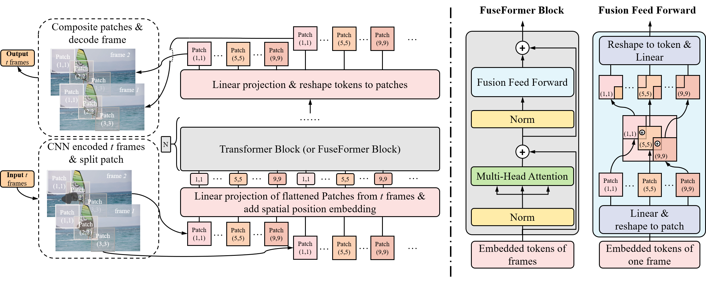

# FuseFormer: Fusing Fine-Grained Information in Transformers for Video Inpainting

By [Rui Liu](https://ruiliu-ai.github.io), Hanming Deng, Yangyi Huang, Xiaoyu Shi, [Lewei Lu](https://dblp.org/pid/247/6438.html), [Wenxiu Sun](http://wenxiusun.com/), [Xiaogang Wang](https://www.ee.cuhk.edu.hk/~xgwang/), [Jifeng Dai](https://jifengdai.org/), [Hongsheng Li](https://www.ee.cuhk.edu.hk/~hsli/). 

This repo is the official Pytorch implementation of [FuseFormer: Fusing Fine-Grained Information in Transformers for Video Inpainting](https://arxiv.org/abs/2109.02974).

## Introduction


## Usage

### Prerequisites
- Python >= 3.6
- Pytorch >= 1.0 and corresponding torchvision (https://pytorch.org/)

### Install
- Clone this repo:
```
git clone https://github.com/ruiliu-ai/FuseFormer.git
```
- Install other packages:
```
cd FuseFormer
pip install -r requirements.txt
```

## Training

### Dataset preparation
Download datasets ([YouTube-VOS](https://competitions.codalab.org/competitions/20127) and [DAVIS](https://davischallenge.org/davis2017/code.html)) into the data folder.

```
mkdir data
```
Note: We use [YouTube Video Object Segmentation dataset **2019** version](https://youtube-vos.org/dataset/).

### Training script
```
python train.py -c configs/youtube-vos.json
```

## Test
Download [pre-trained model](https://drive.google.com/file/d/1BuSE42QAAUoQAJawbr5mMRXcqRRKeELc/view?usp=sharing) into checkpoints folder.
```
mkdir checkpoints
```

### Test script
```
python test.py -c checkpoints/fuseformer.pth -v data/DAVIS/JPEGImages/blackswan -m data/DAVIS/Annotations/blackswan
```

## Evaluation
You can follow [free-form mask generation scheme](https://github.com/JiahuiYu/generative_inpainting) for synthesizing random masks.

Or just download [our prepared stationary masks](https://drive.google.com/file/d/1wihArvScAFT9hs3KDGSoCEjsEjXpfEOL/view?usp=sharing) and unzip it to data folder. 
```
mv random_mask_stationary_w432_h240 data/
mv random_mask_stationary_youtube_w432_h240 data/
```

Then you need to download [pre-trained model](https://drive.google.com/file/d/1A-ilDsXZCVhWh2_erApyL7C0jXhaeTjR/view?usp=sharing) for evaluating [VFID](https://github.com/deepmind/kinetics-i3d). 
```
mv i3d_rgb_imagenet.pt checkpoints/
```

### Evaluation script
```
python evaluate.py --model fuseformer --ckpt checkpoints/fuseformer.pth --dataset davis --width 432 --height 240
python evaluate.py --model fuseformer --ckpt checkpoints/fuseformer.pth --dataset youtubevos --width 432 --height 240
```
For evaluating warping error, please refer to https://github.com/phoenix104104/fast_blind_video_consistency

## Citing FuseFormer
If you find FuseFormer useful in your research, please consider citing:
```
@InProceedings{Liu_2021_FuseFormer,
  title={FuseFormer: Fusing Fine-Grained Information in Transformers for Video Inpainting},
  author={Liu, Rui and Deng, Hanming and Huang, Yangyi and Shi, Xiaoyu and Lu, Lewei and Sun, Wenxiu and Wang, Xiaogang and Dai, Jifeng and Li, Hongsheng},
  booktitle = {International Conference on Computer Vision (ICCV)},
  year={2021}
}
```

## Acknowledement
This code borrows heavily from the video inpainting framework [spatial-temporal transformer net](https://github.com/researchmm/STTN). 
